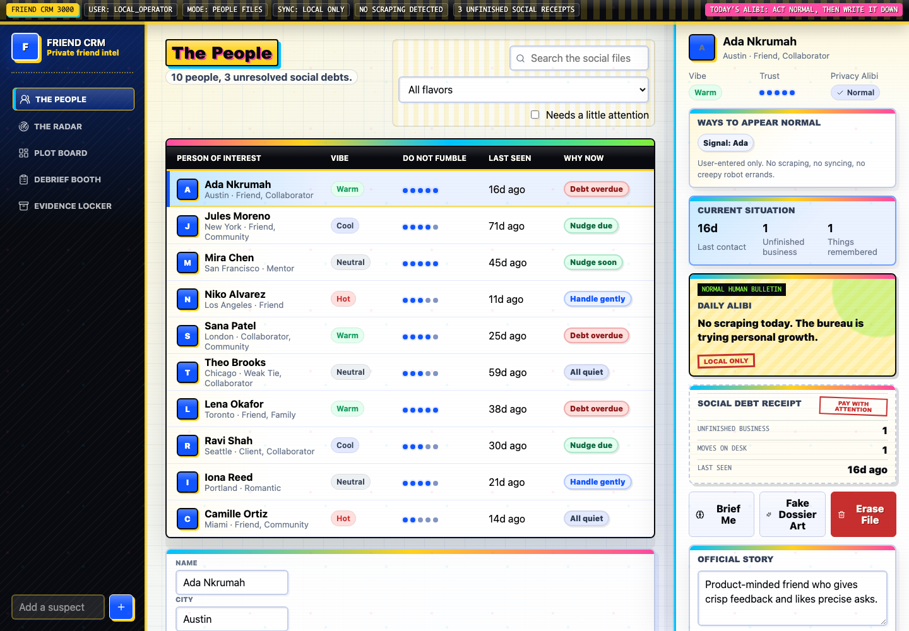
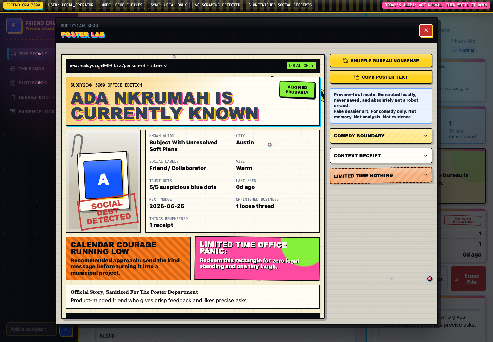
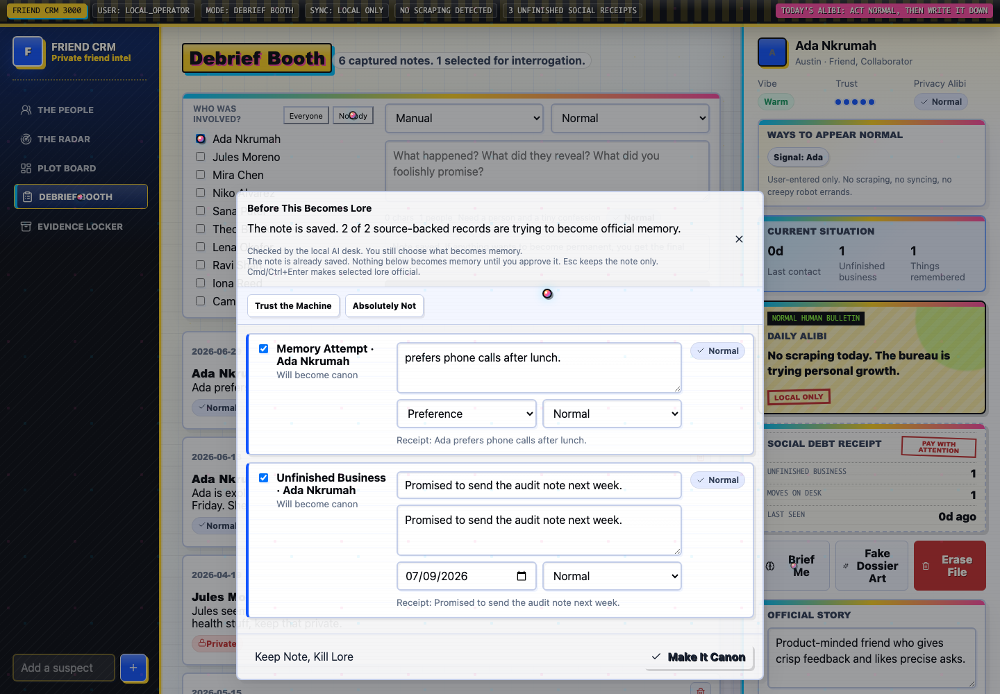
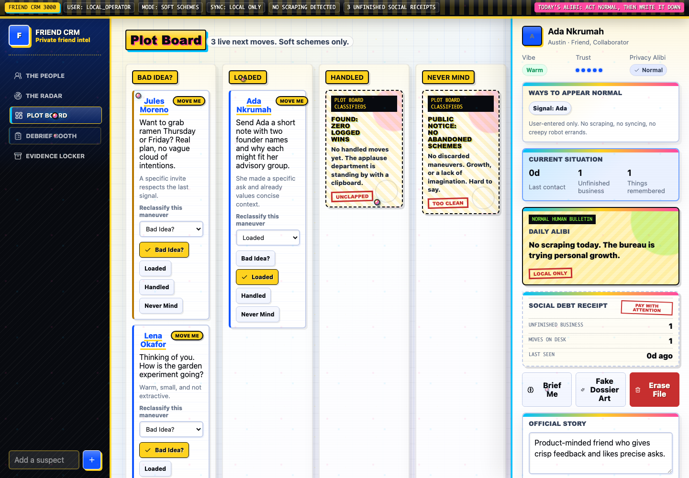
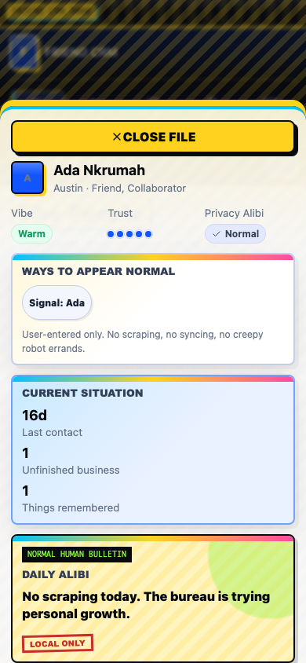
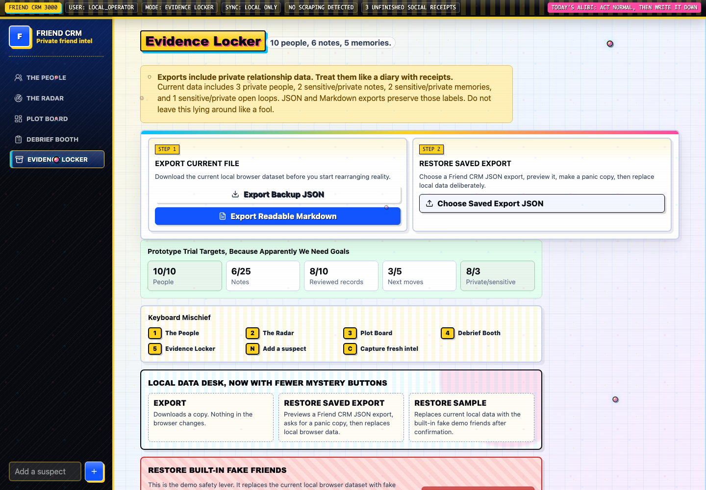

# Friend CRM

Friend CRM is a tongue-in-cheek retro relationship desk with modern local-first functionality, AI-aware workflows, and privacy-first boundaries.

It helps one person remember people, promises, context, boundaries, and next moves without turning friendship into sales software.



## The Idea

Friend CRM looks like a fake-serious early-web social intelligence bureau. That is intentional. The interface jokes about the creepiness of tracking relationships while the product deliberately refuses the actually creepy behavior:

- No private message scraping.
- No automated outreach.
- No hidden scoring.
- No durable AI-generated memory without user confirmation.
- User-owned data stays exportable, restorable, and deletable.

The result is a playful prototype with serious product ethics underneath.

## What It Does

- Manage people, relationship labels, social/contact fields, photos, warmth, trust, and sensitivity.
- Capture reflection notes about conversations and promises.
- Review source-backed suggested memories and open loops before they become durable records.
- Generate draft pre-meeting briefs and next-move ideas from known context.
- Move next actions through a playful Plot Board.
- Export, import, restore, reset, and delete local data.
- Run deterministic fake-data demo flows without real private data or provider keys.

## Screenshots

| People Desk | Poster Lab |
| --- | --- |
|  |  |

| Review Panel | Plot Board |
| --- | --- |
|  |  |

| Mobile Dossier | Evidence Locker |
| --- | --- |
|  |  |

## AI And Privacy Model

Friend CRM treats AI as a drafting assistant, not an authority.

- The database owns facts.
- AI proposes structure and language.
- Durable memory requires explicit user review.
- Suggestions should be traceable to user-entered notes.
- Public/demo mode can run with deterministic fallback behavior.
- Real provider calls are intended to stay server-side.

Current status: provider-compatible development route shells exist, but the portfolio-safe demo should run on fake data with deterministic fallback behavior.

## Tech Stack

- Vite
- React
- TypeScript
- Custom CSS
- Local browser storage
- Schema-versioned JSON export/import
- Optional Supabase hosted persistence foundation
- Vitest
- Playwright-powered browser regression scripts
- Expo mobile prototype under `apps/mobile`

## Run Locally

```bash
npm install
npm run dev
```

Then open the local Vite URL.

## Validate The Demo

Run the full local demo readiness baseline:

```bash
FRIEND_CRM_DISABLE_PROVIDER=1 npm run demo:check
```

That command runs:

- Unit/component tests.
- Production build.
- UI route smoke checks.
- Desktop browser regression.
- Mobile browser regression.
- Tablet browser regression.

Other useful commands:

```bash
npm test
npm run build
npm run portfolio:screenshots
npm run mobile:check
```

## Expo Mobile Prototype

An Expo iOS/mobile companion prototype lives in:

```txt
apps/mobile/
```

It includes People, Dossier, Debrief, Review, Plot Board, and Evidence Locker flows with fake-data reset and local AsyncStorage persistence.

Run it with:

```bash
npm run mobile:start
npm run mobile:ios
```

Notes:

- The mobile app does not call AI providers.
- It uses fake/demo data by default.
- It keeps the same no-scraping, no-automated-outreach, user-confirmed-memory product rules.

## Portfolio Materials

- [Portfolio case study](docs/PORTFOLIO_CASE_STUDY.md)
- [Symposium Studios page package](docs/07-ops/SYMPOSIUM-PORTFOLIO-PAGE-PACKAGE.md)
- [Portfolio screenshot gallery](docs/07-ops/portfolio-screenshots-2026-06-29/SHOT-LIST.md)
- [Project plan](docs/07-ops/PROJECT-PLAN.md)
- [Demo checklist](docs/07-ops/DEMO-CHECKLIST.md)
- [Supabase backend notes](docs/SUPABASE_BACKEND.md)

## Current Status

Friend CRM is a playable local-first prototype with fake seeded data, browser-based QA coverage, mobile/tablet coverage, source-backed AI workflow shells, and export/restore paths.

Optional Supabase schema/client groundwork exists for future authenticated sync, but production hosting, authentication UI, live hosted persistence, and real-user private-data workflows are intentionally out of scope for the current portfolio demo.

## Product Rules

- Keep it a private relationship intelligence desk, not sales software.
- Do not scrape messages.
- Do not automate outreach.
- Do not add hidden scoring.
- Do not commit real user data, credentials, secrets, or provider keys.
- Keep user-owned data visible, exportable, and deletable.
