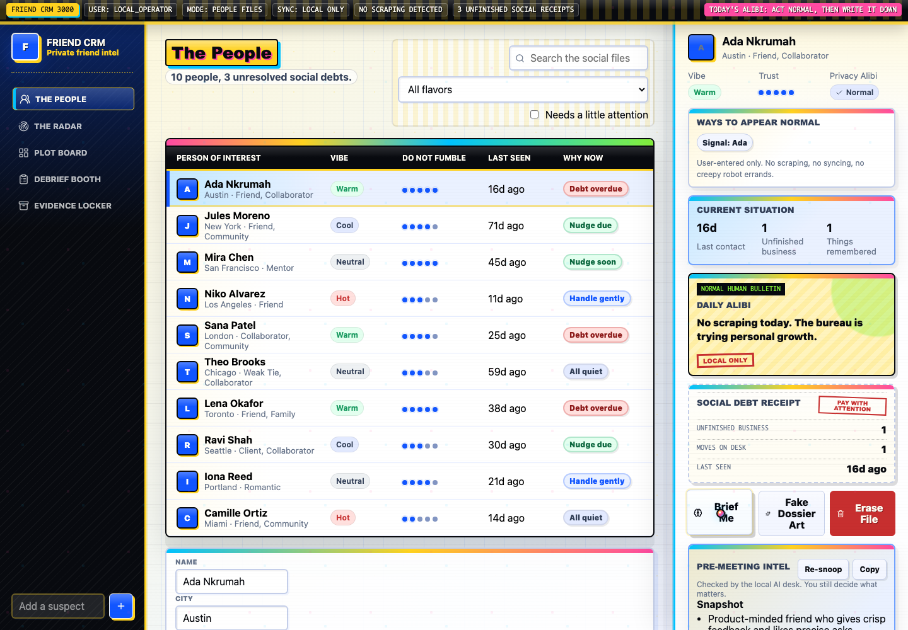
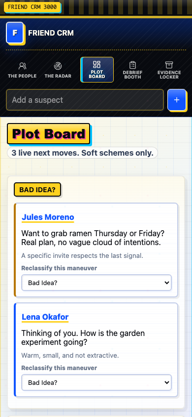
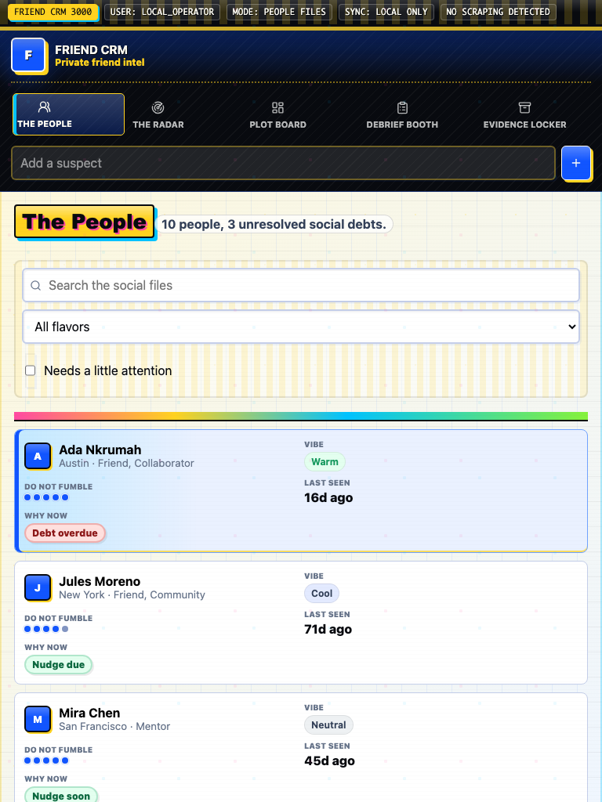

# Portfolio Screenshot Gallery - 2026-06-29

These screenshots are curated for the Symposium Studios Friend CRM portfolio/product page.

Positioning:

> Friend CRM is a tongue-in-cheek retro relationship desk with modern AI-aware workflows, local-first data, and privacy-first boundaries.

## Shots

## 1. 01-desktop-people-desk.png

Caption: Hero candidate: the retro private relationship desk with selected dossier rail.

## 2. 02-desktop-person-brief.png

Caption: AI-aware brief flow framed as a draft, not official truth.

## 3. 03-desktop-review-panel.png

Caption: Source-backed review panel where suggestions require user confirmation.

## 4. 04-desktop-plot-board.png

Caption: Playful next-move planning board with retro classified-desk personality.

## 5. 05-desktop-poster-lab.png

Caption: Poster Lab shows the tongue-in-cheek retro parody without becoming durable memory.

## 6. 06-desktop-evidence-locker.png

Caption: Export, restore, and reset controls make the privacy story visible.

## 7. 07-mobile-people-drawer.png

Caption: Mobile dossier drawer keeps the private desk usable on a phone.

## 8. 08-mobile-plot-board.png

Caption: Mobile Plot Board uses compact planning controls instead of relying on drag gestures.

## 9. 09-tablet-people-editor.png

Caption: Tablet profile editing groups identity, timing, photo, labels, socials, and summary into scannable sections.

## Suggested Portfolio Use

- Hero: `01-desktop-people-desk.png`.
- Product walkthrough: screenshots 2-6.
- Responsive proof: screenshots 7-9.
- Optional social crop: `05-desktop-poster-lab.png` for the loud retro identity.

# Friend CRM Portfolio Screenshots - 2026-06-29

These screenshots support the Symposium Studios Friend CRM portfolio/product page.

Generated on 2026-07-01 from the live local Friend CRM app after booting the Vite dev server, because the named 2026-06-29 portfolio screenshot package was not present in the checkout.

## Shots

1. `01-desktop-people-desk.png` - Desktop People Desk hero.
2. `02-desktop-person-brief.png` - Desktop pre-meeting briefing.
3. `03-desktop-review-panel.png` - Desktop source-backed review panel.
4. `04-desktop-plot-board.png` - Desktop Plot Board.
5. `05-desktop-poster-lab.png` - Desktop Poster Lab personality shot.
6. `06-desktop-evidence-locker.png` - Desktop Evidence Locker safety/export surface.
7. `07-mobile-people-drawer.png` - Mobile person drawer/dossier.
8. `08-mobile-plot-board.png` - Mobile Plot Board.
9. `09-tablet-people-editor.png` - Tablet people editor.

## Capture Notes

- Source server: `http://127.0.0.1:8783`
- Raw desktop/mobile capture folder: `docs/07-ops/portfolio-capture-raw-2026-07-01/`
- Raw tablet capture folder: `docs/07-ops/portfolio-tablet-raw-2026-07-01/`
- Browser audit reported no blocker findings. Medium warnings remain around a mobile tagline control that may clip vertically.